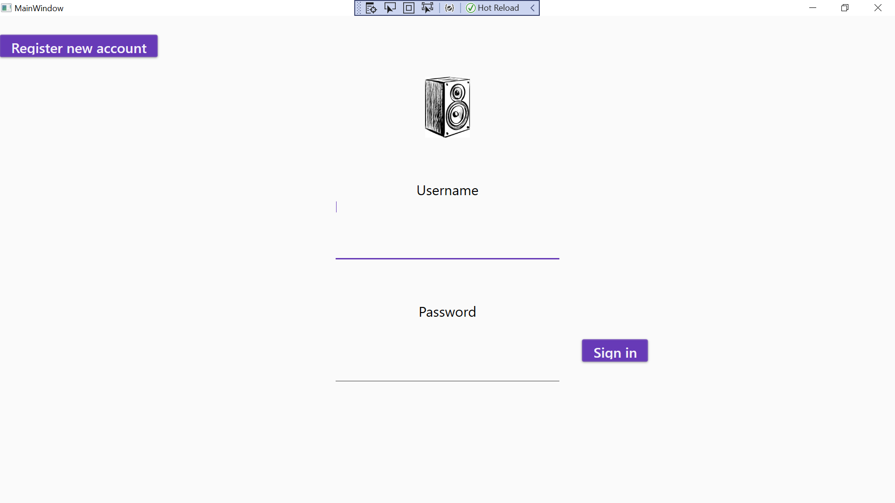

# EF-Radio-Project

## Contents

1.  [Project Description] (# Project Description)
1.  [Preparation] (# Preparation)
1.  [Approach] (# Approach)
1.  [Sprints] (# Sprints)
1.  [Retrospective] (# Retrospective)
1.  [Installation Guide] (# Installation Guide)

## Project Description

#### Task
This project assignment was given as part of the C# SDET programme from Sparta global as the mid-course project. 

At this point we had covered C# Core, OOP, Data, WPF and agile, and the task was to produce a three tier application using the principles learnt previously. The three tiers consist of 

1. A Database layer, holding all relevant tables and relationships, using SQL.
2.  An intermediate/business layer,  using C# and entity framework to communicate with and use the database, as well as any other behind the scenes functionality/architecture needed.
3.  A GUI layer, using WPF to build the frontend of the application.

The application ideas were independently determined, planned and executed by each member of the class, and using the SCRUM framework we divided the project into seven sprints starting on Tuesday 11/05/21 and ending on Tuesday 18/05/21 where we presented our final products in a general meeting in the Sparta Academy.

#### My implementation

    My goal was to expand on a smaller project started on the course, which was a simple radio/playlist project. The project functions as a playlist creator and music player and was chosen because of my passion for music and already having a good idea of what I wanted it to become. 

​    

1. Database layer.
	- Users.
	- Playlists.
	- Tracks.
2. Intermediate/business layer.
	- User manager.
	- Playlist manager.
	- Track manager.
3.  GUI layer.
	- Playback interface.
	- Authentication interface.
	- Playlist management interface.

## Preparation

Initial ERD:

## Wireframe (Created in sprint 3):

Login page

Playback page 

Registration page

Settings navigation page

Search directories page

Manage channels page

Change details page

## Sprints

- ## Sprint 1 - 11/05/2021

  ### Review 

  Completed

  1. User Story 1.1A
  2. Cleanup previous code from the radio project and move files
  3. Create ERD
  4. Create database
  5. Reorganised project

  Not Completed

  1. Implement database in log in and registration
  2. Create settings page
  3. Complete/update project board

  Next steps

  1. Complete not completed steps 
  2. Start building playlist functions and tests.

  ### RetroSpective

  

  Sprint was somewhat productive, but was held back by minimal planning of database aspects and general foresight. Could have been managed better but made steady progress. Have clearer idea of upcoming problems and potential solutions regarding database. For next time, plan out the architecture and build a mental user story going through all processes.
  

  
  

  - ## Sprint 2 - 12/05/2021

  ### Review 

  Completed

  1. Cleanup previous code from the radio project and move files
  2. Create ERD
  3. Create database
  4. Set up registration and log in pages with buttons, fields and navigation
  5. Reorganised project

  Not Completed

  1. Implement database in log in and registration
  2. Create settings page
  3. Complete/update project board

  Next steps

  1. Complete not completed steps 
  2. Start building playlist functions and tests.

  ### RetroSpective

  

  Sprint was somewhat productive, but was held back by minimal planning of database aspects and general foresight. Could have been managed better but made steady progress. Have clearer idea of upcoming problems and potential solutions regarding database. For next time, plan out the architecture and build a mental user story going through all processes.
  

    - ## Sprint 3 - 13/05/2021

  ### Review 

  Completed

  1. Wireframing the gui
  2. Adding settings page and completing navigation 
  3. Adding functions to add and remove playlist - User story 2.2A
  4. Integrating tracks column with IWMP interface

  Not Completed

  1. Testing playlist functions to add and remove
  2. Adding tracks to playlist functions
  3. Adding search directories

  Next steps

  1. Find a way to add tracks to playlist
  2. Test all playlist functions
  3. Add search directory functionality

Could have been much better organized

- ## Sprint 4 - 14/05/2021 - Incomplete

  ### Review 

  Completed

  1. Decoupled tracks class from IWMP interface
  2. Removed unnecessary tables from database
  3. Adding functions to add and remove playlist
  4. Integrating tracks column with IWMP interface

  Not Completed

  1. Testing playlist functions to add and remove
  2. Adding tracks to playlist functions
  3. Adding search directories

  Next steps

  1. Find a way to add tracks to playlist
  2. Test all playlist functions
  3. Add search directory functionality.

  

  

- ## Sprint 5 - 15/05/2021 - Incomplete

  ### Review 

  Completed

  1. Wireframing the gui
  2. Adding settings page and completing navigation
  3. Adding Pfunctions to add and remove playlist
  4. Integrating tracks column with IWMP interface

  Not Completed

  1. Testing playlist functions to add and remove
  2. Adding tracks to playlist functions
  3. Adding search directories

  Next steps

  1. Find a way to add tracks to playlist
  2. Test all playlist functions
  3. Add search directory functionality

  

  

- ## Sprint 6 - 16/05/2021

  ### Review 

  Completed

  1. Started updating, incorporating Material designer.
  2. Finished folder browser, used okaii folder dialog.
  3. Added Filemanager class and functions.
  
  Not Completed
  
  1. Finishing visual updates
  
  2. Logo
  
  3. Return buttons.
  
     
  
  Next steps
  
  1. Finish updating visuals
  2. Fix new bugs
  3. Add return button functionality.
  
  

  

  - ## Sprint 7 - 17/05/2021

  ### Review 

  Completed

    1. Changed listbox design by adding card background to each one from material designer.
    2. Added logo
    3. Fixed playback bugs
    4. Added return button to registration page
    5. Changed playback button display to typical icons

  Not Completed

    1. Finishing readme

  Next steps

  1. This readme.
    2. Reorganize project board.

### Final product

Final ERD:

Final login page:

Final registration page:

Final playback page:

Final playlist management page:

Final search directory page:

Final settings navigation page:

Final account info page:

## Setup

1. Install and upgrade VS2019 (Visual studio 2019) version must be community or better.
2. If you don't already have these tools, install using modify installation in visual studio installer.
   1. Data storage and processing
   2. .Net desktop development.
3. Open MyJukebox.sln in VS2019 and if not prompted, use right click on solution in solution explorer, navigate to manage Nuget packages for solution, and install
   1. Entity Framework Core
   2. Entity Framework Core.Tools
   3. Entity Framework Core.SqlServer
4. On top bar navigate to Tools > Nuget Package Manager  and select the PCM (package manager console).
5. At the bottom of window, select new PCM window and change the default project to radio database.
6. In the PCM console type Add-Migration Initial Create and run (Enter).
7. In the PCM console type Update-Database and run.
8. Run the programme using Debug/Run button at top of window.

